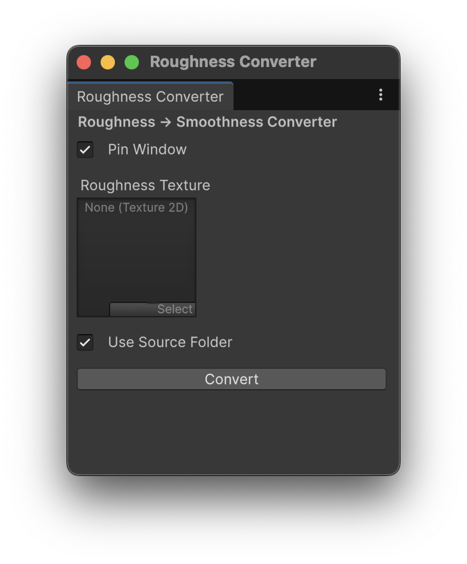

# Unity Roughness Texture Convector

A tool for Unity that allows you to convert Roughness textures directly in the editor

## Usage

1. Go to `Tools > Roughness To Smoothness Converter` in the Unity menu.


2. Select the Roughness image you want to convert.



3. Clicking the `Convert` button will generate a new image. By default, it will be generated in the same directory as
   the original file..
   You can select any directory by unchecking the `Use Source Folder` checkbox.

## Installation

1. Open Unity Package Manager (`Window > Package Manager`).
2. Click `+` > `Add package from git URL`.
3. Enter:

```
https://github.com/RemoteMS/Unity-Roughness-Convector.git?path=/Src
```

4. Click `Add`.

Alternatively, open Packages/manifest.json and add the following to the dependencies block:

```json
{
  "dependencies": {
    "com.rms.unity-roughness-texture-convector": "https://github.com/RemoteMS/Unity-Roughness-Convector.git?path=/Src"
  }
}
```

## License

MIT License (see LICENSE file).